# Architecture Design: Document Reader & Digitizer

> Generated from [SPECS.md](./SPECS.md) — May 28, 2026

## 1. Overview

A localhost-deployed, monolithic web application built with Node.js/TypeScript and a React frontend. Documents are uploaded via drag-and-drop or batch select, processed through a local AI pipeline (Tesseract OCR → Ollama LLM), and stored in SQLite with original files on the local filesystem. A human-in-the-loop review step ensures classification accuracy before records are finalized. The architecture favors simplicity — a single-process server with an embedded job queue — appropriate for the small scale and localhost-only deployment.

---

## 2. System Context

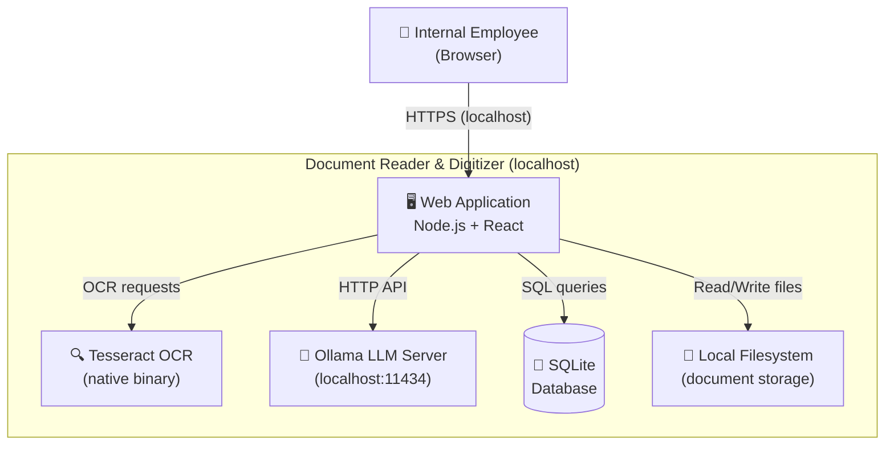

**External Actors:**

| Actor | Description |
|-------|-------------|
| Internal Employee | Uploads documents, reviews AI suggestions, searches/exports data |
| Tesseract | Native OCR binary invoked as a child process for text extraction |
| Ollama | Local LLM server providing classification, extraction, summarization, and sentiment analysis |

**No external network dependencies.** All processing stays on-device.

---

## 3. Components

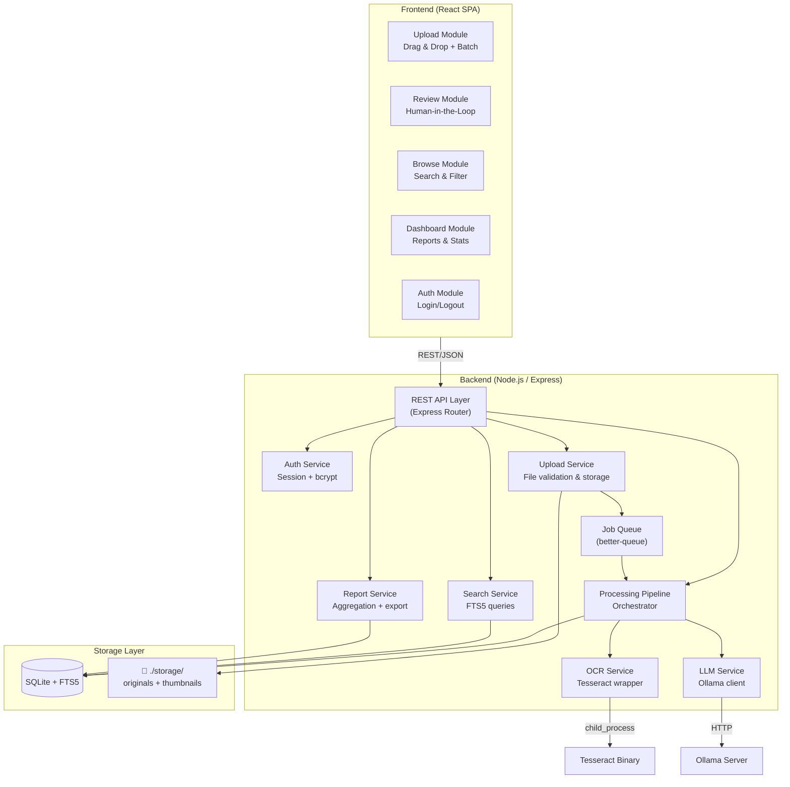

### Component Responsibilities

| Component | Responsibility |
|-----------|---------------|
| **Upload Module** | Drag-and-drop UI, batch file selection, upload progress |
| **Review Module** | Display AI suggestions with confidence, allow confirm/edit/reject |
| **Browse Module** | Advanced filter panel (status, tags, type, date range, size), full-text search, sort, active filter badges, tag-based document grouping |
| **Dashboard Module** | Charts for doc counts, processing stats, accuracy trends |
| **Auth Module** | Login form, session management |
| **REST API Layer** | Route handling, request validation, auth middleware |
| **Auth Service** | Password hashing (argon2), session creation, cookie management |
| **Upload Service** | File type validation, sanitization, filesystem write, job creation |
| **Processing Pipeline** | Orchestrates OCR → LLM extraction → classification → summarization |
| **Job Queue** | Manages async batch processing; retries on failure |
| **OCR Service** | Wraps Tesseract CLI; handles image preprocessing (deskew, contrast) |
| **LLM Service** | Ollama API client; prompt templates for each AI task |
| **Search Service** | Full-text search via SQLite FTS5; metadata filtering |
| **Report Service** | Aggregation queries, CSV/JSON export generation |

---

## 4. Data Architecture

### Entity Relationship Diagram

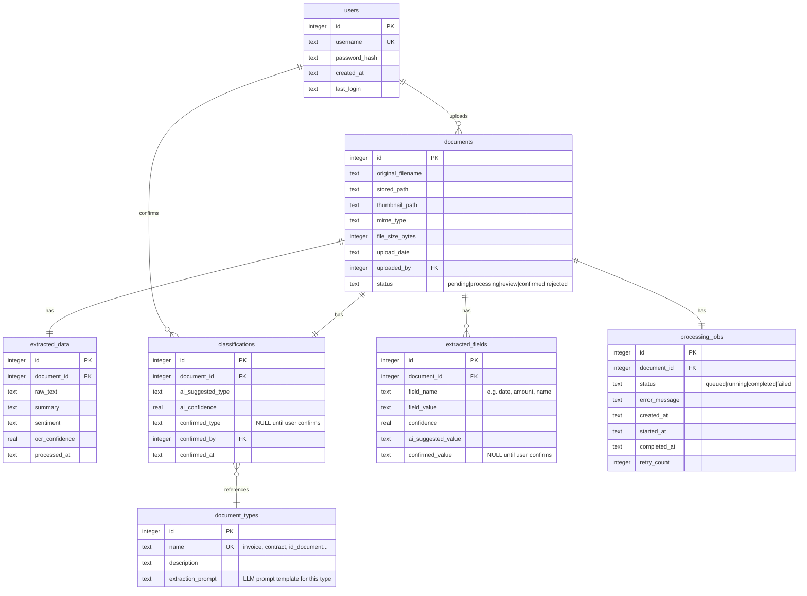

### Storage Technology Choices

| Concern | Choice | Rationale |
|---------|--------|-----------|
| Structured data | **SQLite** | Zero-config, single-file, perfect for localhost |
| Full-text search | **SQLite FTS5** | Built-in, no separate search engine needed |
| File storage | **Local filesystem** | `./storage/originals/{YYYY}/{MM}/{uuid}.{ext}` |
| Thumbnails | **Local filesystem** | `./storage/thumbnails/{uuid}.webp` |

### Filesystem Structure

```
./storage/
├── originals/
│   ├── 2026/
│   │   ├── 01/
│   │   │   ├── a1b2c3d4.pdf
│   │   │   └── e5f6g7h8.png
│   │   └── 02/
│   └── ...
└── thumbnails/
    ├── a1b2c3d4.webp
    └── e5f6g7h8.webp
```

---

## 5. Key Design Decisions

### Decision 1: Frontend Framework — React + shadcn/ui

Largest ecosystem, excellent TypeScript support, rich component libraries. shadcn/ui (Tailwind-based) provides clean, accessible components.

### Decision 2: Local LLM — Llama 3.1 8B via Ollama

Best balance of extraction accuracy and instruction following. 16 GB RAM recommended. Fallback: Phi-3 Mini for constrained hardware.

### Decision 3: Job Queue — better-queue with SQLite store

Zero external dependencies (no Redis). Persists jobs across restarts. Appropriate for localhost scale.

### Decision 4: Large Documents — Chunked Processing

Split text into ~3000 token chunks with 200-token overlap. Process independently, merge results (union fields, majority-vote classification, re-summarize concatenated summaries).

### Decision 5: Extensible Taxonomy — Database-Driven

Document types in `document_types` table with `extraction_prompt` column. New types added via DB insert, no code changes.

---

## 6. Infrastructure

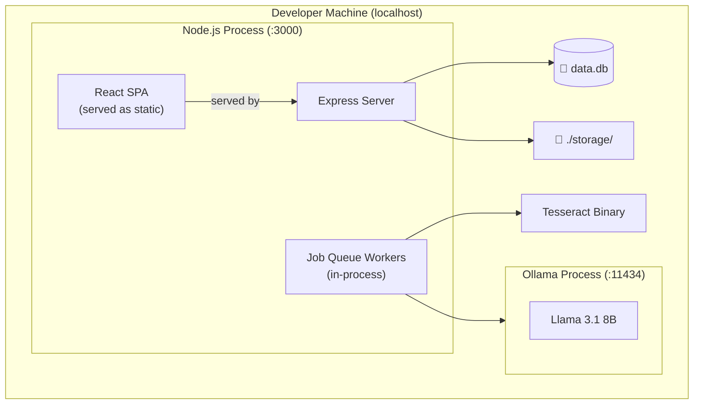

### Deployment

**Single-process monolith** — Express serves the API and React SPA.

| Concern | Solution |
|---------|----------|
| Web server | Express on port 3000 |
| Static assets | React build via `express.static` |
| Database | SQLite at `./data/app.db` |
| OCR | Tesseract binary (`brew install tesseract`) |
| LLM | Ollama on port 11434 |
| Process management | Single `npm start` |
| Logging | Pino → stdout + rotating file |
| Monitoring | `/api/health` endpoint |

### Startup Sequence

1. Check prerequisites (Tesseract, Ollama, model pulled)
2. Run SQLite migrations
3. Start Express server
4. Initialize job queue workers
5. Serve on http://localhost:3000

---

## 7. Risks & Mitigations

| # | Risk | Severity | Likelihood | Mitigation |
|---|------|----------|------------|------------|
| 1 | LLM accuracy too low | High | Medium | Human-in-the-loop; prompt engineering; per-type prompts; accuracy tracking |
| 2 | LLM processing too slow | Medium | Medium | Async queue with progress UI; option to use smaller model |
| 3 | SQLite concurrency limits | Low | Low | WAL mode; < 100 users is well within limits |
| 4 | Large file uploads | Medium | Medium | Configurable size limit (50 MB default); stream to disk |
| 5 | Poor OCR on low-quality scans | Medium | High | Image preprocessing (deskew, contrast, noise reduction) |
| 6 | SQLite data loss | High | Low | WAL mode; periodic backup script |
| 7 | File upload attacks | High | Low | MIME + magic bytes validation; sanitize filenames; store outside web root |
| 8 | Ollama not running | Low | Medium | Health check on startup; retry with backoff |

---

## 8. API Surface

| Method | Endpoint | Purpose |
|--------|----------|---------|
| `POST` | `/api/auth/login` | Authenticate, create session |
| `POST` | `/api/auth/logout` | Destroy session |
| `POST` | `/api/documents/upload` | Upload documents (multipart) |
| `GET` | `/api/documents` | List with filtering/pagination/sorting (`status`, `tags`, `type`, `from`, `to`, `minSize`, `maxSize`, `search`, `sort`, `dir`) |
| `GET` | `/api/documents/:id` | Document details + extracted data |
| `GET` | `/api/documents/:id/original` | Serve original file |
| `GET` | `/api/documents/:id/thumbnail` | Serve thumbnail |
| `PATCH` | `/api/documents/:id/confirm` | Confirm classification + fields |
| `PATCH` | `/api/documents/:id/fields` | Edit extracted fields |
| `PATCH` | `/api/documents/:id/classify` | Override classification |
| `DELETE` | `/api/documents/:id` | Delete document |
| `GET` | `/api/documents/search?q=` | Full-text search |
| `GET` | `/api/reports/summary` | Dashboard stats |
| `GET` | `/api/reports/export?format=csv` | Export CSV/JSON |
| `GET` | `/api/types` | List document types |
| `POST` | `/api/types` | Add document type + prompt |
| `GET` | `/api/health` | System health |

---

## 9. Processing Pipeline

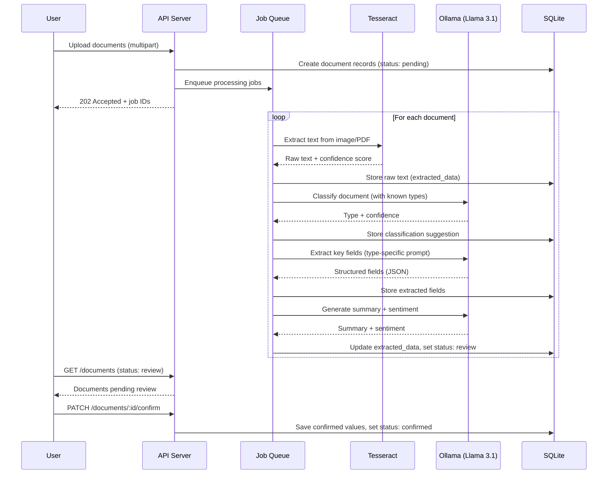

---

## 10. Implementation Phases

| Phase | Task | Priority |
|-------|------|----------|
| 1 | Project scaffold — Node.js/TS, Express, React (Vite), SQLite | P0 |
| 2 | File upload + storage — multipart, validation, UUID naming | P0 |
| 3 | Tesseract OCR integration — wrapper + preprocessing | P0 |
| 4 | Ollama LLM integration — client + prompt templates | P0 |
| 5 | Processing pipeline — job queue orchestrating OCR → LLM | P0 |
| 6 | Review UI — side-by-side viewer, confirm/edit/reject | P1 |
| 7 | Authentication — argon2, sessions, middleware | P1 |
| 8 | Search & browse — FTS5, filtering, pagination | P1 |
| 9 | Dashboard & reporting — aggregation, charts, export | P2 |
| 10 | Security hardening — CSRF, rate limiting, input sanitization | P2 |
| 11 | Tagging system — flexible document labels, tag-based filtering | P2 |
| 12 | Advanced filter system — composable multi-criteria filter panel | P2 |

---

## 11. Tagging System (Flexible Document Labels)

### Overview

To support sorting and filtering documents by client, type, or any custom label, the system implements a flexible tagging mechanism. Tags are many-to-many: each document can have multiple tags, and each tag can be used on many documents.

### Data Model

```mermaid
erDiagram
    documents ||--o{ document_tags : ""
    tags ||--o{ document_tags : ""
    documents {
        integer id PK
        ...existing fields...
    }
    tags {
        integer id PK
        text name UK
    }
    document_tags {
        integer document_id FK
        integer tag_id FK
    }
```

- **tags**: id, name (unique)
- **document_tags**: document_id, tag_id

### API Endpoints

| Method | Endpoint | Purpose |
|--------|----------|---------|
| `GET` | `/api/tags` | List all tags |
| `POST` | `/api/tags` | Create new tag |
| `POST` | `/api/documents/:id/tags` | Assign tags to document |
| `DELETE` | `/api/documents/:id/tags/:tagId` | Remove tag from document |
| `GET` | `/api/documents?tags=...` | Filter documents by tag(s) |

### UI/UX
- Tag badges shown in document list and review page
- Add/remove tags in upload and review UI (with autocomplete)
- Filter/search by tag(s) in document list

### Implementation Plan
1. **DB Migration**: Add `tags` and `document_tags` tables, with indexes
2. **Backend**: Implement tag CRUD and document-tag assignment endpoints; update document APIs to include tags; support filtering by tag(s)
3. **Frontend**: Show tags, add tag input with autocomplete, add tag filter to list
4. **Testing**: Unit/integration tests for tag assignment, filtering, and UI
5. **Docs**: Update user guide for tagging features

### Rationale
- Tags allow unlimited, user-defined categories (client, project, type, priority, etc.)
- No schema changes needed for new categories—just add new tags
- Enables powerful filtering, grouping, and sorting

---

## 12. Advanced Filter System

### Overview

A composable filter panel that lets users combine multiple criteria simultaneously: status, tags, document type, date range, file size, and full-text search — all encoded in the URL for sharing and bookmarking, executed as a single optimized SQL query on the backend.

### UI Component Design

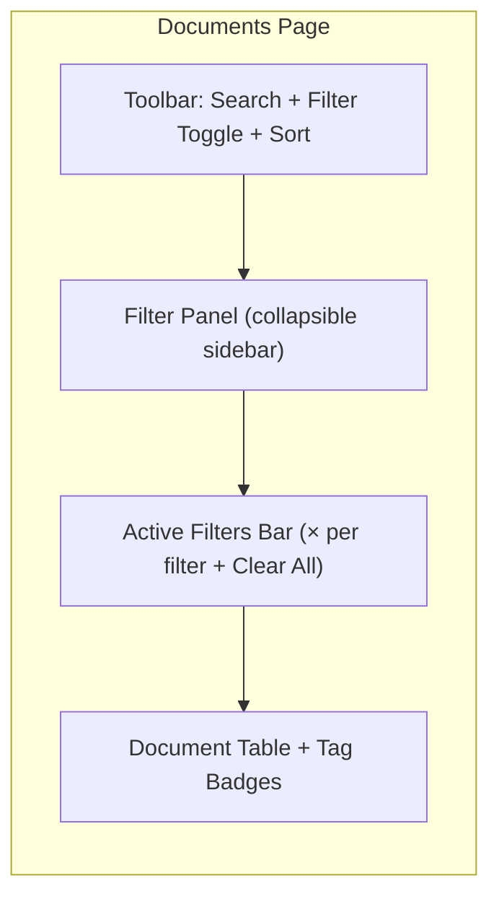

**Filter Panel sections:**

| Section | Component | Behavior |
|---------|-----------|----------|
| Status | Toggle chips | Multi-select (OR) — Pending, Processing, Review, Confirmed, Rejected |
| Tags | Multi-select autocomplete | AND logic — documents must have all selected tags |
| Document Type | Dropdown multi-select | Populated from `/api/types` |
| Upload Date | From / to date inputs | Inclusive range |
| File Size | Min / max with unit toggle | Bytes, KB, MB |
| Sort | Field + direction | Upload date, filename, size, status |

**Active Filter Bar** — appears whenever any filter is active; shows dismissible badges (e.g. `Status: review` `Tag: Acme Corp` `Type: invoice`) with a global **Clear All** button.

### Filter State & URL Schema

All filter state is encoded in URL search params so filters are shareable and bookmarkable:

```
/documents?status=review,pending
           &tags=3,7
           &type=invoice,contract
           &from=2026-01-01&to=2026-05-31
           &minSize=0&maxSize=2097152
           &search=acme
           &sort=upload_date&dir=desc
```

**Filter state type:**

```typescript
interface DocumentFilters {
  statuses: string[];        // [] = all
  tagIds: number[];          // [] = all, AND logic
  types: string[];           // [] = all
  from: string | null;       // ISO date
  to: string | null;         // ISO date
  minSize: number | null;    // bytes
  maxSize: number | null;    // bytes
  search: string;            // FTS5 full-text
  sort: "upload_date" | "original_filename" | "file_size_bytes" | "status";
  dir: "asc" | "desc";
}
```

### API Changes to `GET /api/documents`

Extended query parameters:

| Param | Type | Example | Logic |
|-------|------|---------|-------|
| `status` | CSV | `review,confirmed` | OR |
| `tags` | CSV IDs | `3,7` | AND (doc must have all) |
| `type` | CSV | `invoice,contract` | OR (confirmed or AI type) |
| `from` | ISO date | `2026-01-01` | Upload date ≥ |
| `to` | ISO date | `2026-05-31` | Upload date ≤ |
| `minSize` | bytes | `0` | File size ≥ |
| `maxSize` | bytes | `2097152` | File size ≤ |
| `search` | string | `acme` | FTS5 full-text |
| `sort` | field | `upload_date` | Sort field |
| `dir` | `asc`\|`desc` | `desc` | Sort direction |

**Sortable fields:** `upload_date`, `original_filename`, `file_size_bytes`, `status`

### Composite SQL Pattern

```sql
SELECT d.*
FROM documents d
LEFT JOIN classifications c ON c.document_id = d.id
WHERE d.status IN ('review', 'pending')
  AND d.id IN (
    SELECT dt.document_id FROM document_tags dt
    WHERE dt.tag_id IN (3, 7)
    GROUP BY dt.document_id HAVING COUNT(DISTINCT dt.tag_id) = 2
  )
  AND COALESCE(c.confirmed_type, c.ai_suggested_type) IN ('invoice', 'contract')
  AND d.upload_date >= '2026-01-01'
  AND d.upload_date <= '2026-05-31'
  AND d.file_size_bytes BETWEEN 0 AND 2097152
  AND d.id IN (
    SELECT ed.document_id FROM extracted_data ed
    JOIN documents_fts fts ON fts.rowid = ed.id
    WHERE documents_fts MATCH 'acme'
  )
ORDER BY d.upload_date DESC
LIMIT 20 OFFSET 0
```

### Implementation Plan

1. **Frontend — `DocumentFilters` type** — define canonical filter state interface
2. **Frontend — `useDocumentFilters` hook** — parse/serialize URL ↔ filter state
3. **Frontend — `FilterPanel` component** — collapsible sidebar with all filter controls
4. **Frontend — `ActiveFiltersBar` component** — dismissible badges, Clear All
5. **Frontend — `SortControl` component** — field + direction selector
6. **Frontend — Update documents page** — wire `FilterPanel`, `ActiveFiltersBar`, `SortControl`, pass filters to API
7. **Backend — extend `DocumentListParams`** — add `statuses[]`, `types[]`, `from`, `to`, `minSize`, `maxSize`, `sort`, `dir`
8. **Backend — update `listDocuments`** — build composite SQL dynamically from all params
9. **Backend — update route** — parse all new query params and forward to service

### Design Decisions

- **AND logic for tags, OR for statuses/types** — matches natural user intent (must have all tags for a client; any of these statuses)
- **URL as single source of truth** — no local state; filter changes update URL, which triggers re-fetch
- **Single SQL query** — all conditions composed into one query, no N+1 for list view
- **No dedicated search endpoint** — filtering, sorting, and FTS all handled by the same list endpoint

---

## 13. German Bookkeeping AI Agent (Buchungsassistent)

> Added: May 30, 2026

### 13.1 Overview

The Buchungsassistent is a domain-specific AI agent layered on top of the existing document processing pipeline. When a document is classified as a German accounting document (Rechnung, Quittung, Kontoauszug, Mahnung, Lohnunterlage, etc.), the agent runs an additional, specialized LLM pass that extracts structured bookkeeping data, assigns a suggested SKR03/SKR04 account category, flags VAT issues, detects missing mandatory fields under German law (§14 UStG), and produces a German-language human-readable summary. A dedicated Bookkeeping Review UI allows the operator to inspect, correct, and confirm the extracted bookkeeping record before it becomes part of the accounting ledger.

The agent does **not** replace a licensed Steuerberater. It explicitly marks tax-sensitive decisions as requiring professional confirmation and surfaces a legal-boundary disclaimer in the UI.

---

### 13.2 System Context Extension

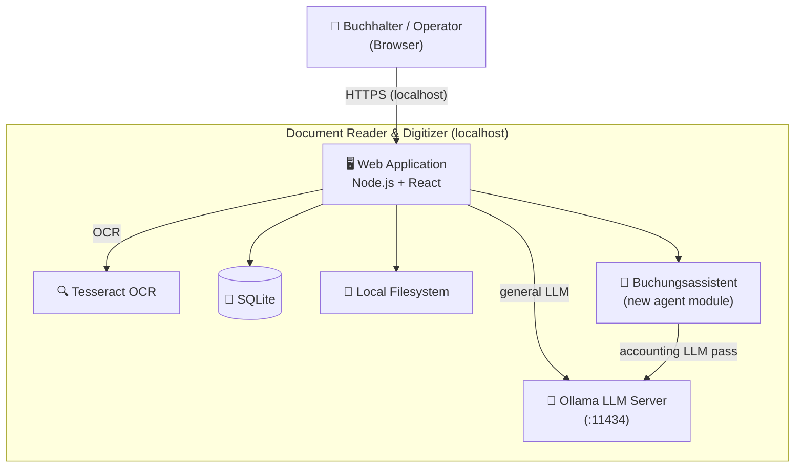

The Buchungsassistent is an **in-process module** within the same Node.js server. It does not require a separate process or network service.

---

### 13.3 Agent Components

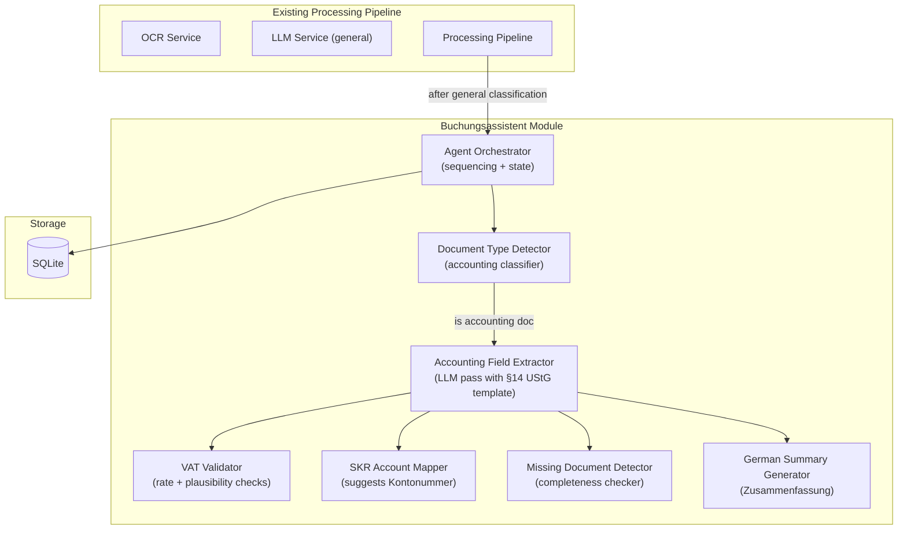

### Component Responsibilities

| Component | Responsibility |
|-----------|----------------|
| **Agent Orchestrator** | Called by the Processing Pipeline after the general classification step. Decides whether to run the accounting agent based on document type. Sequences sub-steps and writes results to DB. |
| **Document Type Detector** | Classifies document as one of the supported Belegarten (see §13.5). Uses a focused prompt; re-uses the OCR text already extracted by the pipeline. |
| **Accounting Field Extractor** | Runs a structured LLM prompt (§14 UStG field list) against the OCR text. Returns a JSON payload of all accounting-relevant fields. |
| **VAT Validator** | Stateless rule engine (no LLM). Checks: VAT rate is 0%, 7%, or 19%; VAT amount = net × rate ± 0.02 EUR tolerance; if gross ≠ net + VAT, flags discrepancy. |
| **SKR Account Mapper** | Rule-based + LLM fallback. Maps description keywords and Belegart to a suggested SKR03 Kontonummer. LLM fallback when no rule matches, with low-confidence flag. |
| **Missing Document Detector** | Compares mandatory §14 UStG fields against extracted values. Produces a list of missing or empty mandatory fields. |
| **German Summary Generator** | Calls LLM with a German-language prompt and the extracted field JSON. Returns a structured Zusammenfassung in German. |

---

### 13.4 Extended Processing Pipeline

```mermaid
sequenceDiagram
    participant U as Operator
    participant API as API Server
    participant Q as Job Queue
    participant OCR as Tesseract
    participant LLM as Ollama
    participant BA as Buchungsassistent
    participant DB as SQLite

    U->>API: Upload Rechnung / Kontoauszug
    API->>DB: Create document record (status: pending)
    API->>Q: Enqueue job

    Q->>OCR: Extract text
    OCR-->>Q: Raw text + confidence

    Q->>LLM: General classification
    LLM-->>Q: Type (e.g. "invoice") + confidence

    Q->>BA: invoke(documentId, rawText, classifiedType)

    BA->>BA: Detect Belegart (Rechnung / Quittung / Kontoauszug…)
    BA->>LLM: Accounting field extraction prompt (§14 UStG)
    LLM-->>BA: Structured JSON fields

    BA->>BA: Validate VAT (rule engine)
    BA->>BA: Map SKR account (rules + LLM fallback)
    BA->>BA: Check mandatory fields (§14 UStG completeness)
    BA->>LLM: Generate Zusammenfassung (German)
    LLM-->>BA: Zusammenfassung text

    BA->>DB: Write accounting_records row
    BA->>DB: Write accounting_field_issues rows
    Q->>DB: Set status: review

    U->>API: GET /api/accounting/:documentId
    API-->>U: Accounting record + issues + Zusammenfassung

    U->>API: PATCH /api/accounting/:documentId/confirm
    API->>DB: Confirm record, set accounting_status: confirmed
```

---

### 13.5 Supported Belegarten

| Belegart | German Name | Key Extraction Fields |
|----------|-------------|----------------------|
| `eingangsrechnung` | Eingangsrechnung | Lieferant, RE-Nr, RE-Datum, Netto, USt, Brutto, Fälligkeit |
| `ausgangsrechnung` | Ausgangsrechnung | Kunde, RE-Nr, RE-Datum, Netto, USt, Brutto, Fälligkeit |
| `quittung` | Quittung / Kassenbon | Aussteller, Datum, Betrag, Zweck |
| `kontoauszug` | Kontoauszug | IBAN, Buchungsdatum, Betrag, Empfänger/Sender, Verwendungszweck |
| `mahnung` | Mahnung | Gläubiger, Schuldner, offener Betrag, Frist |
| `lohnabrechnung` | Lohnabrechnung | Mitarbeiter, Monat, Bruttolohn, Abzüge, Nettolohn |
| `vertrag` | Vertrag / Rahmenvertrag | Vertragsparteien, Datum, Laufzeit, Betrag |
| `datev_export` | DATEV Export (CSV/Excel) | Buchungsdatum, Konto, Gegenkonto, Betrag, Buchungstext |
| `unbekannt` | Unbekanntes Dokument | Fallback — minimal extraction, requires manual review |

---

### 13.6 Data Architecture Extension

#### New Tables

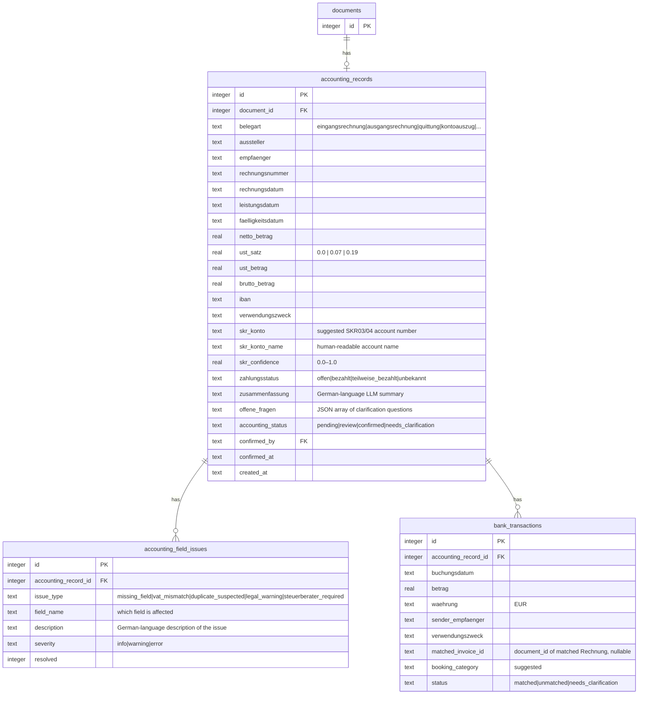

#### Migration File

A new SQL migration `012-accounting-agent.sql` adds the three tables above plus indexes:

```sql
-- indexes
CREATE INDEX IF NOT EXISTS idx_accounting_records_document_id  ON accounting_records(document_id);
CREATE INDEX IF NOT EXISTS idx_accounting_records_status       ON accounting_records(accounting_status);
CREATE INDEX IF NOT EXISTS idx_accounting_records_belegart     ON accounting_records(belegart);
CREATE INDEX IF NOT EXISTS idx_accounting_field_issues_record  ON accounting_field_issues(accounting_record_id);
CREATE INDEX IF NOT EXISTS idx_bank_transactions_record        ON bank_transactions(accounting_record_id);
```

---

### 13.7 Prompt Templates

All prompts are stored in `server/src/services/prompt-templates.ts` (existing file — new exports added).

#### 13.7.1 Belegart Detection Prompt

```
System: You are a German accounting document classifier. Classify the following OCR text as exactly one of:
eingangsrechnung, ausgangsrechnung, quittung, kontoauszug, mahnung, lohnabrechnung, vertrag, datev_export, unbekannt.
Respond with ONLY a JSON object: {"belegart": "<type>", "confidence": <0.0-1.0>}

User: <OCR_TEXT>
```

#### 13.7.2 Accounting Field Extraction Prompt (§14 UStG)

```
System: You are a German bookkeeping assistant. Extract all accounting fields from the following document text.
Return ONLY a valid JSON object with these exact keys (use null for missing fields):
{
  "aussteller": null,
  "empfaenger": null,
  "rechnungsnummer": null,
  "rechnungsdatum": null,
  "leistungsdatum": null,
  "faelligkeitsdatum": null,
  "netto_betrag": null,
  "ust_satz": null,
  "ust_betrag": null,
  "brutto_betrag": null,
  "iban": null,
  "verwendungszweck": null,
  "zahlungsstatus": null,
  "offene_fragen": []
}
All monetary values as numbers (no currency symbols). Dates as YYYY-MM-DD. VAT rate as decimal (0.19, 0.07, 0.0).

User: <OCR_TEXT>
```

#### 13.7.3 SKR Account Mapping Prompt (LLM fallback)

```
System: You are a German bookkeeping assistant familiar with SKR03 and SKR04 account charts.
Given this document description, suggest the most appropriate SKR03 account number and name.
Respond ONLY with JSON: {"konto": "<4-digit number>", "name": "<account name>", "confidence": <0.0-1.0>}
If unsure, set confidence below 0.5 and explain in "name".

User: Belegart: <BELEGART>, Beschreibung: <DESCRIPTION>
```

#### 13.7.4 German Zusammenfassung Prompt

```
System: Du bist ein deutscher Buchhalter-Assistent. Erstelle eine strukturierte Zusammenfassung des folgenden
Buchhaltungsdokuments auf Deutsch. Verwende das folgende Format:

Zusammenfassung:
- Belegart:
- Aussteller:
- Empfänger:
- Rechnungsdatum:
- Rechnungsnummer:
- Netto:
- Umsatzsteuer:
- Brutto:
- Zahlungsstatus:
- Empfohlene Buchungskategorie:
- Offene Fragen:

Wichtig: Wenn Felder fehlen oder steuerrechtlich unklar sind, weise explizit darauf hin und empfehle,
einen Steuerberater zu konsultieren.

User: <EXTRACTED_FIELDS_JSON>
```

---

### 13.8 VAT Validation Rules (Rule Engine)

The `VATValidator` is a **stateless, deterministic rule engine** — no LLM call. Rules applied in order:

| Rule ID | Check | Severity | Issue Type |
|---------|-------|----------|------------|
| VAT-001 | `ust_satz` ∈ {0.0, 0.07, 0.19} | error | `vat_mismatch` |
| VAT-002 | \|`netto * ust_satz` − `ust_betrag`\| ≤ 0.02 EUR | error | `vat_mismatch` |
| VAT-003 | \|`netto + ust_betrag` − `brutto`\| ≤ 0.02 EUR | error | `vat_mismatch` |
| VAT-004 | All three amounts present | warning | `missing_field` |
| VAT-005 | `brutto` > 0 | warning | `missing_field` |

---

### 13.9 SKR03 Account Mapping Rules (Static Rules — No LLM)

Rule-based lookup table applied before the LLM fallback:

| Belegart | Keyword match | SKR03 Konto | Kontoname |
|----------|--------------|-------------|-----------|
| `eingangsrechnung` | Bürobedarf, Papier, Druckerpatronen | 4930 | Bürobedarf |
| `eingangsrechnung` | Telefon, Internet, Mobilfunk | 4920 | Telefon |
| `eingangsrechnung` | Miete, Pacht | 4210 | Miete |
| `eingangsrechnung` | Strom, Gas, Wasser | 4240 | Heizung, Licht, Energie |
| `eingangsrechnung` | Versicherung | 4360 | Beiträge und Versicherungen |
| `eingangsrechnung` | Kfz, Tankstelle, Kraftstoff | 4530 | Kfz-Kosten |
| `eingangsrechnung` | Amazon, MediaMarkt, IT, Hardware | 0680 | Betriebs- und Geschäftsausstattung |
| `ausgangsrechnung` | *(any)* | 8400 | Erlöse (19% USt) |
| `ausgangsrechnung` | *(any, 7% USt)* | 8300 | Erlöse (7% USt) |
| `quittung` | Bewirtung, Restaurant, Essen | 4650 | Bewirtungskosten |
| `quittung` | Porto, Brief, DHL | 4910 | Porto |
| `lohnabrechnung` | *(any)* | 4120 | Gehälter |
| `kontoauszug` | *(matched invoice)* | — | Derived from matched Rechnung |
| *(fallback)* | *(no rule matches)* | LLM | LLM with `confidence < 0.5` |

---

### 13.10 Mandatory Field Completeness Check (§14 UStG)

For `eingangsrechnung` and `ausgangsrechnung`, German law (§14 UStG) requires:

| Field | §14 UStG Reference | Required |
|-------|--------------------|----------|
| `aussteller` (full name + address) | §14 Abs. 4 Nr. 1 | ✅ |
| `empfaenger` (full name + address) | §14 Abs. 4 Nr. 2 | ✅ |
| `steuernummer_or_ust_id` | §14 Abs. 4 Nr. 3 | ✅ |
| `rechnungsdatum` | §14 Abs. 4 Nr. 4 | ✅ |
| `rechnungsnummer` (sequential) | §14 Abs. 4 Nr. 5 | ✅ |
| Description of services/goods | §14 Abs. 4 Nr. 6 | ✅ |
| `leistungsdatum` or Lieferzeitraum | §14 Abs. 4 Nr. 6 | ✅ |
| `netto_betrag` | §14 Abs. 4 Nr. 7 | ✅ |
| `ust_satz` | §14 Abs. 4 Nr. 8 | ✅ |
| `ust_betrag` | §14 Abs. 4 Nr. 8 | ✅ |
| `brutto_betrag` | §14 Abs. 4 Nr. 8 | ✅ |

Any missing mandatory field generates an `accounting_field_issues` row with `severity = error` and `issue_type = missing_field`.

For invoices > 250 EUR gross, all fields above are mandatory. For Kleinbetragsrechnungen ≤ 250 EUR (§33 UStDV), a reduced set applies — the validator checks the threshold automatically.

---

### 13.11 API Surface (New Endpoints)

| Method | Endpoint | Purpose |
|--------|----------|---------|
| `GET` | `/api/accounting` | List accounting records (filterable by `belegart`, `status`, `from`, `to`, `missing_fields`) |
| `GET` | `/api/accounting/:documentId` | Full accounting record + field issues + Zusammenfassung |
| `PATCH` | `/api/accounting/:documentId/confirm` | Operator confirms record (sets `accounting_status: confirmed`) |
| `PATCH` | `/api/accounting/:documentId/fields` | Operator corrects extracted accounting fields |
| `GET` | `/api/accounting/summary` | Monthly summary: Einnahmen, Ausgaben, USt gezahlt, USt eingenommen, offene Posten |
| `GET` | `/api/accounting/vat-report` | Umsatzsteuervoranmeldung data for a given period (`from`, `to`) |
| `GET` | `/api/accounting/open-items` | Open receivables and payables (unmatched Rechnungen) |
| `GET` | `/api/accounting/export?format=datev` | DATEV-compatible CSV export (Buchungsstapel format) |
| `GET` | `/api/accounting/export?format=csv` | Generic CSV export |
| `GET` | `/api/bank-transactions` | List bank transactions with match status |
| `PATCH` | `/api/bank-transactions/:id/match` | Manually match bank transaction to a document |
| `POST` | `/api/accounting/:documentId/reprocess` | Re-run the accounting agent on a document |

---

### 13.12 Frontend Extension

#### New Pages / Routes

| Route | Page Component | Purpose |
|-------|---------------|---------|
| `/accounting` | `AccountingDashboardPage` | Monthly summary, VAT overview, open items |
| `/accounting/:documentId` | `AccountingReviewPage` | Side-by-side: original doc + extracted fields + issues |
| `/accounting/vat-report` | `VatReportPage` | Umsatzsteuervoranmeldung data view |
| `/accounting/open-items` | `OpenItemsPage` | Offene Forderungen und Verbindlichkeiten |
| `/bank-transactions` | `BankTransactionsPage` | Bank transaction list with match status |

#### New Components

| Component | Description |
|-----------|-------------|
| `AccountingFieldEditor` | Editable form for all §14 UStG fields; shows validation errors inline |
| `FieldIssuesList` | Renders `accounting_field_issues` as colored banners (info/warning/error) |
| `ZusammenfassungPanel` | Displays German LLM summary in a structured panel |
| `VatSummaryCard` | Card showing Netto / USt / Brutto with validation state |
| `SkrAccountBadge` | Shows suggested SKR account; highlights low-confidence assignments |
| `LegalDisclaimerBanner` | Prominent banner: "Kein Ersatz für einen Steuerberater" — always visible in accounting views |
| `BankTransactionRow` | Table row with match status, drag-to-match UI placeholder |
| `MonthlySummaryTable` | Income / expense / VAT breakdown by month |
| `DatevExportButton` | Triggers DATEV CSV download with date range picker |

#### Accounting Review Page Layout

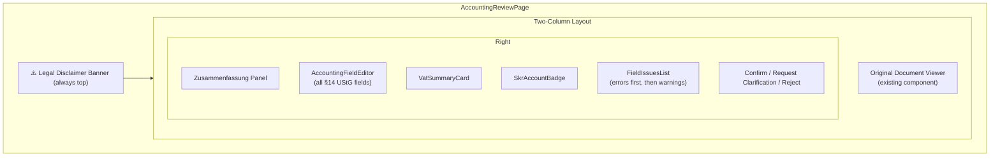

---

### 13.13 Accounting Dashboard

The `AccountingDashboardPage` aggregates across all confirmed accounting records for the selected month/period:

```
Zusammenfassung:
- Einnahmen (Netto):      [sum of ausgangsrechnungen netto]
- Ausgaben (Netto):       [sum of eingangsrechnungen netto]
- USt eingenommen:        [sum of ausgangsrechnungen ust_betrag]
- USt gezahlt:            [sum of eingangsrechnungen ust_betrag]
- USt-Zahllast:           [USt eingenommen − USt gezahlt]
- Offene Forderungen:     [count + sum of unpaid ausgangsrechnungen]
- Offene Verbindlichkeiten: [count + sum of unpaid eingangsrechnungen]
- Fehlende Belege:        [count of field_issues with severity=error]
- Klärungsbedarf:         [count of accounting_status=needs_clarification]
```

Transaction table (rendered as `MonthlySummaryTable`):

| Datum | Beschreibung | Betrag | Kategorie | USt | Status | Frage |
|-------|-------------|-------:|-----------|----:|--------|-------|

---

### 13.14 DATEV Export Format

The DATEV Buchungsstapel CSV export follows the DATEV ASCII format specification (header + data rows). Fields produced per row:

| DATEV Field | Source |
|------------|--------|
| `Umsatz` | `brutto_betrag` |
| `Soll/Haben-Kennzeichen` | Derived from `belegart` |
| `Konto` | `skr_konto` |
| `Gegenkonto` | Derived (e.g. 1600 Verbindlichkeiten LuL for Eingangsrechnung) |
| `Belegdatum` | `rechnungsdatum` |
| `Belegnummer` | `rechnungsnummer` |
| `Buchungstext` | `aussteller` + description substring |
| `Steuerschlüssel` | Derived from `ust_satz` (9 = 19%, 2 = 7%, 0 = 0%) |

The export endpoint returns `Content-Type: text/csv; charset=UTF-8` with a `Content-Disposition: attachment` header.

---

### 13.15 Key Design Decisions

#### Decision A: Agent as In-Process Module, Not Separate Service

**Options:**
- A: In-process module within the existing Node.js server
- B: Separate microservice (HTTP or IPC)

**Decision: A — In-Process Module**

**Rationale:** The system is already a localhost monolith. A separate service adds deployment complexity (two processes, health checks, IPC) with no benefit at this scale. The agent shares the existing Ollama client, SQLite connection, and job queue infrastructure without duplication.

**Consequences:** Agent upgrades require restarting the single server process. Acceptable for localhost deployment.

---

#### Decision B: Rule-Based VAT Validation, Not LLM

**Options:**
- A: Pure rule engine for VAT arithmetic checks
- B: Ask LLM to validate VAT

**Decision: A — Rule Engine**

**Rationale:** VAT arithmetic is deterministic (net × rate = VAT ± rounding). An LLM adds latency, cost, and non-determinism to a check that has a definitive correct answer. Rules also produce structured `accounting_field_issues` rows with field-level precision that the UI can display inline.

---

#### Decision C: German as Default Output Language

**Options:**
- A: All agent outputs in German (Zusammenfassung, Fragen, Fehlermeldungen)
- B: English with translation layer

**Decision: A — German by Default**

**Rationale:** The agent is specialized for German accounting. Operators and Steuerberater work in German. English summaries would require re-translation, adding a lossy step. The UI displays German text verbatim.

**Consequences:** Developer tooling (logs, code, comments) remains in English. Only user-facing agent outputs are in German.

---

#### Decision D: SKR03 as Default Chart of Accounts

**Options:**
- A: SKR03 (default for most German SMEs)
- B: SKR04 (alternative for corporations and some service firms)
- C: User-configurable per company

**Decision: A — SKR03 default, with config flag for SKR04**

**Rationale:** SKR03 covers the vast majority of small and medium-sized German businesses. A single `ACCOUNTING_CHART=SKR03|SKR04` environment variable allows switching without code changes. Both charts share account structures — the SKR mapper module is parameterized.

---

#### Decision E: Steuerberater Legal Boundary Enforcement

**Options:**
- A: Agent refuses to process tax-sensitive documents
- B: Agent processes, flags, and always surfaces disclaimer + recommends Steuerberater

**Decision: B — Process + Flag + Disclaim**

**Rationale:** Refusing to process reduces utility. The agent's value is in organizing and pre-processing data — it explicitly marks any tax-sensitive conclusion as `issue_type: steuerberater_required` and never presents a binding tax recommendation. The `LegalDisclaimerBanner` is non-dismissible in all accounting views.

---

### 13.16 New File Structure

The following new files/directories are added to the existing project structure:

```
server/src/
├── services/
│   ├── accounting-agent.ts          # Agent Orchestrator — entry point
│   ├── belegart-detector.ts         # Document type detection (LLM)
│   ├── accounting-field-extractor.ts # §14 UStG field extraction (LLM)
│   ├── vat-validator.ts             # VAT rule engine (no LLM)
│   ├── skr-mapper.ts                # SKR03/04 account mapping (rules + LLM fallback)
│   ├── completeness-checker.ts      # §14 UStG mandatory field completeness
│   ├── zusammenfassung-generator.ts # German summary generation (LLM)
│   └── datev-exporter.ts            # DATEV CSV format builder
├── routes/
│   ├── accounting.ts                # /api/accounting/* routes
│   └── bank-transactions.ts        # /api/bank-transactions/* routes
└── db/
    └── migrations/
        └── 012-accounting-agent.sql # New tables + indexes

client/src/
├── pages/
│   ├── accounting-dashboard-page.tsx
│   ├── accounting-review-page.tsx
│   ├── vat-report-page.tsx
│   ├── open-items-page.tsx
│   └── bank-transactions-page.tsx
└── components/
    ├── accounting-field-editor.tsx
    ├── field-issues-list.tsx
    ├── zusammenfassung-panel.tsx
    ├── vat-summary-card.tsx
    ├── skr-account-badge.tsx
    ├── legal-disclaimer-banner.tsx
    ├── bank-transaction-row.tsx
    ├── monthly-summary-table.tsx
    └── datev-export-button.tsx
```

---

### 13.17 Risks & Mitigations (Agent-Specific)

| # | Risk | Severity | Likelihood | Mitigation |
|---|------|----------|------------|------------|
| A1 | LLM extracts incorrect monetary amounts | High | Medium | VAT rule engine catches arithmetic errors; human confirmation required before record is confirmed |
| A2 | OCR misreads digits in amounts (1 → 7, 0 → 8) | High | Medium | Image preprocessing (contrast, deskew); operator sees original document side-by-side |
| A3 | LLM hallucinates SKR account number | Medium | Medium | Rule-based lookup first; LLM fallback with `confidence < 0.5` flag; low-confidence items highlighted in UI |
| A4 | Missing mandatory §14 UStG fields not detected | High | Low | Deterministic completeness checker — no LLM for field presence checks |
| A5 | Agent presents binding tax advice | High | Low | Legal disclaimer always visible; `steuerberater_required` issue type blocks confirmation of tax-sensitive records |
| A6 | DATEV export format drift | Medium | Low | DATEV ASCII format documented and pinned; export module has unit tests for field mapping |
| A7 | Duplicate invoice detection fails | Medium | Medium | Flag `rechnungsnummer` collisions in DB; surface as `duplicate_suspected` issue |
| A8 | Lohnabrechnung contains personal data | High | Low | No additional risk beyond existing file security model; data stays on localhost |

---

### 13.18 Implementation Phases

| Phase | Task | Priority |
|-------|------|----------|
| BA-1 | DB migration `012-accounting-agent.sql` — add 3 new tables + indexes | P0 |
| BA-2 | `belegart-detector.ts` — LLM-based Belegart detection + prompt template | P0 |
| BA-3 | `accounting-field-extractor.ts` — §14 UStG field extraction + prompt template | P0 |
| BA-4 | `vat-validator.ts` — deterministic VAT rule engine | P0 |
| BA-5 | `completeness-checker.ts` — mandatory field completeness (§14 UStG + §33 UStDV threshold) | P0 |
| BA-6 | `accounting-agent.ts` — orchestrator wiring all sub-steps, called from Processing Pipeline | P0 |
| BA-7 | `accounting.ts` route — GET/PATCH accounting record endpoints | P0 |
| BA-8 | `AccountingReviewPage` + `AccountingFieldEditor` + `FieldIssuesList` + `LegalDisclaimerBanner` | P0 |
| BA-9 | `skr-mapper.ts` — rule table + LLM fallback | P1 |
| BA-10 | `zusammenfassung-generator.ts` — German summary LLM call | P1 |
| BA-11 | `AccountingDashboardPage` + `MonthlySummaryTable` + `VatSummaryCard` | P1 |
| BA-12 | `VatReportPage` — Umsatzsteuervoranmeldung data view | P1 |
| BA-13 | `OpenItemsPage` — open receivables / payables | P2 |
| BA-14 | `bank-transactions.ts` route + `BankTransactionsPage` | P2 |
| BA-15 | `datev-exporter.ts` + `DatevExportButton` + DATEV CSV endpoint | P2 |
| BA-16 | Duplicate invoice detection (rechnungsnummer collision check) | P2 |

---

### 13.19 Legal Disclaimer Text (Mandatory — Non-Dismissible)

The following text **must** appear in the `LegalDisclaimerBanner` component on every accounting-related page, rendered prominently (yellow or amber background, icon ⚠️):

> **Hinweis:** Dieser Buchungsassistent unterstützt die Vorbereitung und Organisation von Buchhaltungsdaten. Er ersetzt keinen Steuerberater und gibt keine verbindliche Steuerberatung. Für den Jahresabschluss, die Steuererklärung, steuerliche Optimierung und alle rechtlich bindenden Entscheidungen wenden Sie sich bitte an einen zugelassenen Steuerberater.

---

## 14. Vision LLM Pipeline (Layout-Aware Document Understanding)

> Added: May 31, 2026

### 14.1 Problem Statement

The current pipeline routes all document content through Tesseract OCR before LLM analysis:

```
Image → Tesseract → Raw Text → LLM
```

Tesseract outputs a **linear text stream**, destroying all 2D spatial relationships:

| Document Element | Spatial Signal | What Is Lost |
|---|---|---|
| Invoice header (two-column layout) | Left = issuer, Right = invoice metadata | Issuer address merged with invoice number/date |
| Bill-To / Ship-To blocks | Side-by-side columns | Two addresses conflated; recipient confused with sender |
| Line item table | Row × column grid | Quantity, unit price, and description lose their association |
| VAT breakdown table | Right-aligned stacked numbers | 19% and 7% row amounts can be swapped |
| Running totals (Netto/USt/Brutto) | Right-aligned, visually separated | Extracted in wrong order or merged with line items |

This directly degrades the accuracy of `belegart-detector.ts` and `accounting-field-extractor.ts`, which both operate on the corrupted text. The LLM must guess spatial structure that was never described to it.

### 14.2 Solution: Vision LLM as Primary Extractor

A **multimodal (vision) LLM** receives the raw document image directly — it sees layout, alignment, column structure, fonts, and spatial groupings. OCR text is retained solely for **full-text search indexing** in SQLite FTS5.

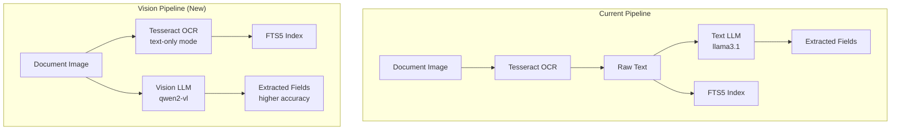

The text LLM (`llama3.1`) is **not removed** — it remains as a fallback for PDF documents where text is already digitally embedded (no image rendering needed), and for the `summarizeDocument` and `analyzeSentiment` steps that operate on prose, not structured layout.

### 14.3 Vision Model Selection

All models below are available via Ollama:

| Model | Size | Strengths | Weaknesses |
|---|---|---|---|
| `qwen3-vl` | 7B+ | Best table and form understanding; multilingual; improved reasoning over qwen2-vl | Requires ~8 GB VRAM |
| `qwen2-vl` | 7B | Good document understanding; widely tested with Ollama | Older generation |
| `llava` | 7B / 13B | Good general vision; widely tested with Ollama | Weaker on dense tables |
| `minicpm-v` | 2B | Very fast; low RAM | Lower accuracy on complex layouts |

**Recommended default:** `qwen3-vl` — strongest at structured document layouts, German text handling, and invoice/form extraction. Configurable via `OLLAMA_VISION_MODEL` environment variable.

### 14.4 Updated System Architecture

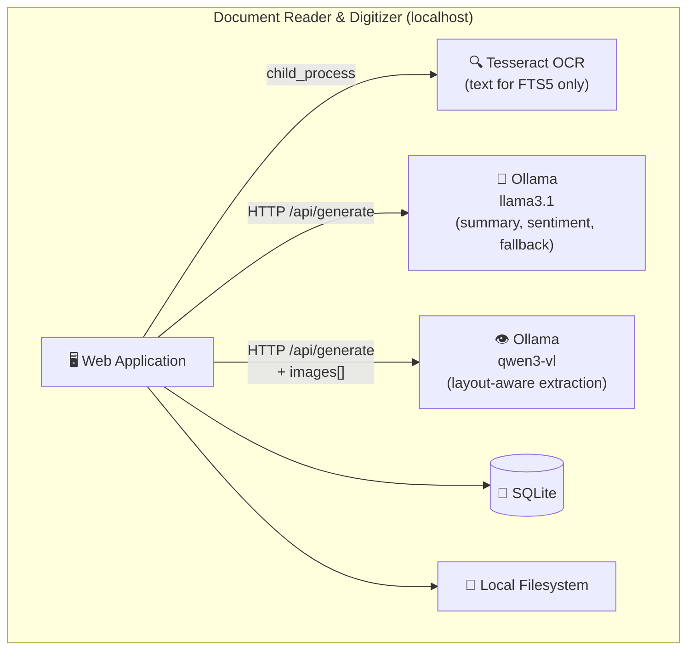

Both LLMs are served by the **same Ollama process** on port 11434. Ollama handles model multiplexing — no second port or process needed. The two models are addressed by name in separate HTTP requests.

### 14.5 Ollama Vision API

Ollama's `/api/generate` endpoint accepts a `images` field containing base64-encoded images. No new protocol is needed:

```json
POST http://localhost:11434/api/generate
{
  "model": "qwen2-vl",
  "prompt": "Extract all §14 UStG accounting fields from this invoice...",
  "images": ["<base64-encoded PNG>"],
  "stream": false,
  "options": { "temperature": 0.1 }
}
```

The `OllamaClient` class gains a single new method `generateWithImage()` that adds the `images` field. All existing text-based calls remain unchanged.

### 14.6 Updated Processing Pipeline

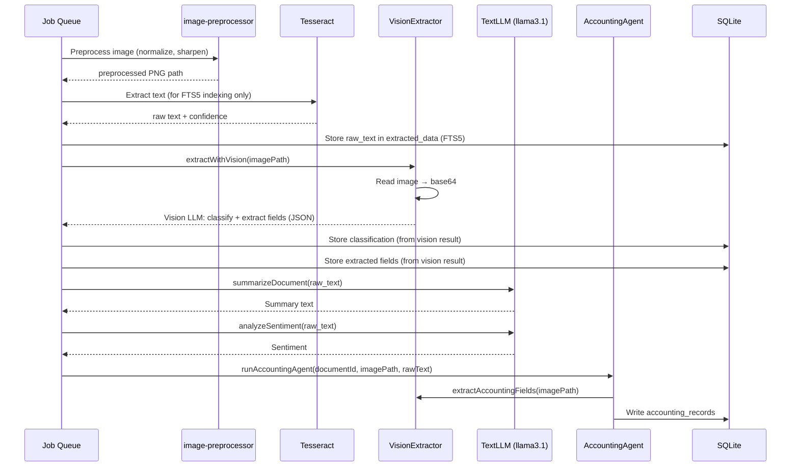

**Key change:** Steps 3 (Classify) and 4 (Extract fields) switch from text LLM to vision LLM. Steps 5 (Summary) and 5b (Sentiment) remain on the text LLM — prose summarization does not benefit from vision. Step 6 (Accounting Agent) uses vision for its field extraction sub-step.

### 14.7 Code Changes Required

#### 14.7.1 `server/src/services/ollama-client.ts`

Add `generateWithImage()` method alongside the existing `generate()`:

```typescript
async generateWithImage(
  prompt: string,
  imageBase64: string,  // base64-encoded image data (no data URI prefix)
  options?: { temperature?: number; maxTokens?: number }
): Promise<string>
```

The implementation POSTs to `/api/generate` with `images: [imageBase64]` and uses `config.ollamaVisionModel` instead of `config.ollamaModel`. A separate singleton `VisionOllamaClient` is exported to keep the two models cleanly separated.

#### 14.7.2 `server/src/config.ts`

Add one new config field:

```typescript
ollamaVisionModel: process.env.OLLAMA_VISION_MODEL || "qwen2-vl",
```

#### 14.7.3 `server/src/services/vision-extractor.ts` (new file)

Responsible for:
1. Reading a document file from disk
2. Converting it to a base64-encoded PNG (using Sharp for images; `pdftoppm` child_process for PDFs — first page only)
3. Calling `VisionOllamaClient.generateWithImage()` with a structured prompt
4. Parsing the JSON response

Exports two functions:
- `classifyDocumentWithVision(filePath): Promise<ClassificationResult>`
- `extractFieldsWithVision(filePath, documentType): Promise<ExtractionResult>`

For PDFs, only the **first page** is rendered to image for the vision call. Full text extraction still uses Tesseract on all pages for FTS5.

#### 14.7.4 `server/src/services/processing-pipeline.ts`

Steps 3 and 4 change from calling `llm-service.ts` functions to calling `vision-extractor.ts` functions, passing `filePath` instead of `ocrResult.text`. The `runAccountingAgent` call gains a third argument: `filePath`.

#### 14.7.5 `server/src/services/accounting-agent.ts`

Signature change: `runAccountingAgent(documentId, rawText, imagePath?)`. When `imagePath` is provided, `belegart-detector.ts` and `accounting-field-extractor.ts` use vision; otherwise they fall back to text.

#### 14.7.6 `server/src/services/belegart-detector.ts`

New overload: `detectBelegart(rawText, imagePath?)`. When `imagePath` is provided, calls `VisionExtractor` with a Belegart detection prompt. Falls back to text-based detection if vision call fails.

#### 14.7.7 `server/src/services/accounting-field-extractor.ts`

New overload: `extractAccountingFields(rawText, imagePath?)`. When `imagePath` is provided, calls `VisionExtractor` with the §14 UStG prompt. Text-based extraction remains as fallback.

#### 14.7.8 `server/src/routes/health.ts`

Add vision model status to `/api/health` response:

```json
{
  "tesseract": "ok",
  "ollama": "ok",
  "ollamaModel": "ok",
  "ollamaVisionModel": "ok"  ← new
}
```

### 14.8 Prompt Design for Vision LLM

Vision prompts must be **more explicit about layout** than text prompts, since the model receives image context that text prompts historically had to assume:

#### Classification prompt (vision):
```
This is a scanned document image. Look at the full layout — headers, columns, tables, logos, and footers.
Classify it as exactly one of: invoice, contract, receipt, bank_statement, payroll, id_document, other.
Return ONLY valid JSON: {"type": "<type>", "confidence": <0.0-1.0>}
```

#### Accounting field extraction prompt (vision):
```
This is an image of a German accounting document. Examine the full layout carefully:
- The issuer (Aussteller) is typically in the TOP-LEFT header block
- The recipient (Empfänger) is in the TOP-RIGHT or below "An:" / "Rechnungsempfänger:"
- Line items are in the central table
- Totals (Netto, USt, Brutto) are in the BOTTOM-RIGHT table

Extract all fields and return ONLY valid JSON with these exact keys (null if not found):
{ "aussteller": null, "empfaenger": null, "rechnungsnummer": null, ... }
```

The explicit layout guidance compensates for cases where the vision model might read the document linearly rather than spatially.

### 14.9 Fallback Strategy

Vision extraction can fail (model not pulled, image too large, model returns unparseable JSON). The pipeline must degrade gracefully:

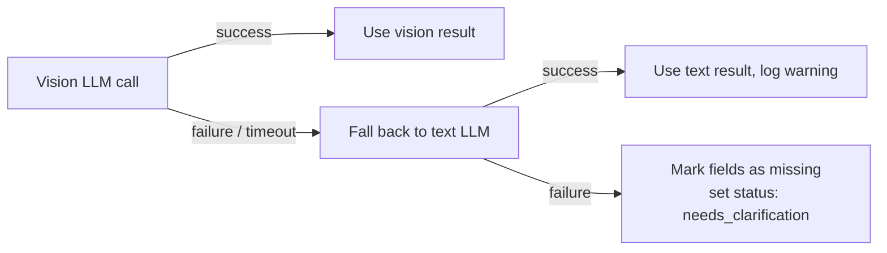

Both `vision-extractor.ts` and the updated `llm-service.ts` functions throw on failure. The pipeline's existing try/catch blocks in `processing-pipeline.ts` already handle this — only the primary call changes, not the error handling structure.

### 14.10 PDF Handling

PDFs require rendering to an image before vision analysis. Two options:

| Option | Tool | Dependency |
|---|---|---|
| `pdftoppm` | Poppler CLI | `brew install poppler` |
| `pdf2pic` | Node.js wrapper around Poppler | `npm install pdf2pic` |

**Decision: `pdf2pic`** — keeps the dependency in `package.json` instead of requiring a system binary separate from the existing Sharp/Tesseract setup. Only the first page is rendered for the vision call (accounts for > 90% of single-page invoices).

### 14.11 Infrastructure Changes

| Concern | Before | After |
|---|---|---|
| LLM model(s) pulled | `llama3.1` | `llama3.1` + `qwen2-vl` |
| Ollama VRAM usage | ~5 GB (llama3.1 8B Q4) | ~13 GB peak (both loaded) |
| New npm dep | — | `pdf2pic` |
| New env var | — | `OLLAMA_VISION_MODEL=qwen3-vl` |
| Startup check | text model | text model + vision model |
| Processing latency | ~15–30 s | ~25–50 s (vision adds one extra LLM call) |

Models are loaded and unloaded by Ollama on demand — they do not both occupy VRAM simultaneously unless requests overlap.

### 14.12 Risks & Mitigations

| # | Risk | Severity | Likelihood | Mitigation |
|---|------|----------|------------|------------|
| V1 | Vision model not available / not pulled | High | Medium | Health check at startup; fallback to text LLM; clear setup doc |
| V2 | VRAM insufficient to run both models | Medium | Medium | Models are swapped by Ollama; no concurrent VRAM requirement |
| V3 | Vision model slower than text LLM | Low | High | Processing is async/queued; latency increase is non-blocking for the user |
| V4 | First-page-only rendering misses fields on page 2 | Medium | Low | Flag in UI for multi-page documents; operator sees all pages in document viewer |
| V5 | Base64 image too large for Ollama request | Medium | Low | Sharp resize to max 1800×2400 px before encoding; ~500 KB typical |
| V6 | Vision model hallucination on poor-quality scans | High | Medium | Same VAT rule engine and completeness checker validate output; human confirmation required |

### 14.13 Implementation Phases

| Phase | Task | Priority |
|-------|------|----------|
| VL-1 | Add `ollamaVisionModel` to `config.ts` | P0 |
| VL-2 | Add `generateWithImage()` + `VisionOllamaClient` singleton to `ollama-client.ts` | P0 |
| VL-3 | Create `vision-extractor.ts` — image → base64, `classifyDocumentWithVision()`, `extractFieldsWithVision()` | P0 |
| VL-4 | Add `pdf2pic` dependency; implement PDF first-page render in `vision-extractor.ts` | P0 |
| VL-5 | Update `belegart-detector.ts` — vision path + text fallback | P0 |
| VL-6 | Update `accounting-field-extractor.ts` — vision path + text fallback | P0 |
| VL-7 | Update `accounting-agent.ts` — accept `imagePath`, pass to detectors/extractors | P0 |
| VL-8 | Update `processing-pipeline.ts` — pass `filePath` to `runAccountingAgent`; replace Steps 3 & 4 with vision calls | P1 |
| VL-9 | Update `llm-service.ts` — `classifyDocument` and `extractFields` accept optional `imagePath`; delegate to `vision-extractor.ts` when provided | P1 |
| VL-10 | Update `/api/health` route — add vision model availability check | P1 |
| VL-11 | Update `config.ts` startup validation — warn if vision model is not pulled | P1 |
| VL-12 | Update `ARCHITECTURE.md` Section 6 infrastructure table with new model and dependency | P2 |
| VL-13 | Update `README` / setup docs — add `ollama pull qwen2-vl` to prerequisites | P2 |

### 14.14 Dependency on Existing Sections

- **Replaces** the OCR→text→LLM path described in Section 9 (Processing Pipeline) for classification and field extraction steps only.
- **Augments** Section 13 (Buchungsassistent) — the accounting agent's field extractor and belegart detector both become vision-primary.
- **Does not change** the FTS5 indexing path, VAT rule engine, SKR mapper static rules, or completeness checker — all remain text-based or rule-based.
- **Does not change** the frontend — no UI modifications are required; the accounting review page displays results regardless of which extraction path produced them.

---

## 15. Receipt Line Item Extraction

> Added: May 31, 2026

### 15.1 Overview

When a document is classified as `quittung` (receipt / Kassenbon), the system extracts individual **line items** from the receipt image using the vision LLM. Each item carries its own description, quantity, unit price, total price, and — critically — its own VAT rate (German receipts routinely mix 7% food items and 19% general goods on the same slip). A pre-seeded, user-extensible **item category taxonomy** allows each line item to be classified (e.g. "Office Supplies", "Fuel", "IT Equipment") for bookkeeping purposes. Users review and confirm AI-suggested categories in the accounting review UI.

### 15.2 Motivation

A single receipt from a petrol station or grocery store may contain:
- Fuel (19% VAT, SKR03 4530 Kfz-Kosten)
- Food (7% VAT, non-deductible private consumption)
- Engine oil (19% VAT, SKR03 4530 Kfz-Kosten)
- An office notepad (19% VAT, SKR03 4930 Bürobedarf)

Without item-level extraction, the entire receipt is booked to a single SKR account at a single VAT rate — which is both inaccurate and potentially non-compliant for mixed receipts.

### 15.3 Data Architecture

#### New Tables

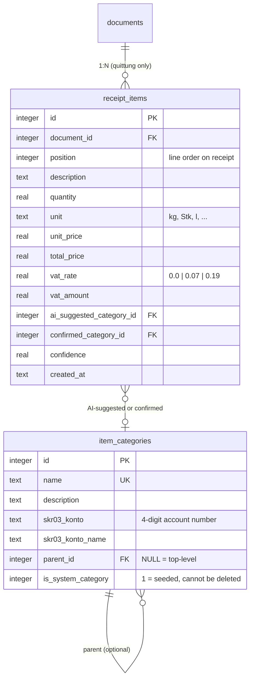

**Design decisions:**
- `receipt_items.document_id` links directly to `documents` (not via `accounting_records.id`) — avoids an extra join and works even when the accounting record is not yet finalized.
- Two category columns: `ai_suggested_category_id` (immutable once set) and `confirmed_category_id` (operator override).
- VAT rate stored **per item** — a single receipt can have items at 7%, 19%, and 0%.
- `unit` is a free-text field to accommodate `kg`, `Stk`, `l`, `m`, `Paar`, etc.
- Negative `total_price` is allowed for Pfand returns and loyalty discounts.

#### Migration File

`013-receipt-items.sql` — adds `item_categories` (with seed data) and `receipt_items`:

```sql
CREATE TABLE item_categories (
  id INTEGER PRIMARY KEY AUTOINCREMENT,
  name TEXT NOT NULL UNIQUE,
  description TEXT,
  skr03_konto TEXT,
  skr03_konto_name TEXT,
  parent_id INTEGER REFERENCES item_categories(id),
  is_system_category INTEGER NOT NULL DEFAULT 1
);

CREATE TABLE receipt_items (
  id INTEGER PRIMARY KEY AUTOINCREMENT,
  document_id INTEGER NOT NULL REFERENCES documents(id) ON DELETE CASCADE,
  position INTEGER NOT NULL DEFAULT 0,
  description TEXT NOT NULL,
  quantity REAL NOT NULL DEFAULT 1,
  unit TEXT,
  unit_price REAL,
  total_price REAL NOT NULL,
  vat_rate REAL NOT NULL DEFAULT 0.19,
  vat_amount REAL,
  ai_suggested_category_id INTEGER REFERENCES item_categories(id),
  confirmed_category_id INTEGER REFERENCES item_categories(id),
  confidence REAL,
  created_at TEXT NOT NULL DEFAULT (datetime('now'))
);

CREATE INDEX idx_receipt_items_document_id ON receipt_items(document_id);
```

#### Pre-seeded Item Category Taxonomy

| id | Category Name | SKR03 | SKR03 Account Name | Notes |
|----|--------------|-------|--------------------|-------|
| 1 | Office Supplies | 4930 | Bürobedarf | Pens, paper, folders, toner |
| 2 | IT Equipment | 0680 | Betriebs- und Geschäftsausstattung | Laptops, cables, USB sticks |
| 3 | IT Software / SaaS | 4960 | Softwarekosten | Licenses, subscriptions |
| 4 | Fuel | 4530 | Kfz-Kosten | Petrol, diesel, AdBlue |
| 5 | Vehicle Costs | 4540 | Sonstige Kfz-Kosten | Car wash, parking, oil, tyres |
| 6 | Food & Beverages (Business) | 4650 | Bewirtungskosten | Business meals, client coffee |
| 7 | Postage & Shipping | 4910 | Porto | Stamps, parcel fees |
| 8 | Cleaning & Hygiene | 4985 | Reinigungskosten | Office cleaning supplies |
| 9 | Books & Training | 4940 | Aus- und Fortbildung | Professional books, courses |
| 10 | Private (non-deductible) | — | — | Personal items on mixed receipt |
| 11 | Other / Uncategorized | 4900 | Sonstige betriebliche Aufwendungen | Fallback category |

Users can add custom categories; system categories (`is_system_category = 1`) cannot be deleted.

### 15.4 Processing Pipeline Extension

Receipt item extraction runs as an additional step **after** `runAccountingAgent()` completes, and only when `belegart = quittung`:

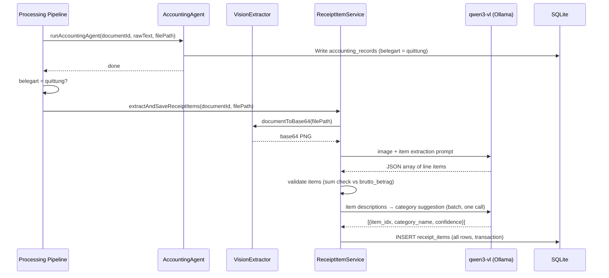

**Two LLM calls for receipts:**
1. **Item extraction** — structured JSON of all line items from the image (run by `ReceiptItemService` via `VisionExtractor`).
2. **Category suggestion** — all item descriptions sent in a single batch prompt; returns one category suggestion per item.

The pipeline step is non-blocking: if item extraction fails, the document is still marked `review` and the accounting record is intact. A warning is logged and no `receipt_items` rows are written.

### 15.5 Vision Prompt Design

#### 15.5.1 Item Extraction Prompt

```
You are a German receipt analysis expert. Look at this receipt image carefully.

Extract every line item. German receipts use these VAT markers:
- A = 19% VAT (standard rate)
- B = 7% VAT (reduced rate for food, books, etc.)
- C / * = 0% VAT

For each item, return:
- description: product name exactly as printed
- quantity: number (default 1 if not shown)
- unit: unit of measure (kg, Stk, l — null if not shown)
- unit_price: price per unit (null if not shown)
- total_price: total line price (positive; use negative for returns/refunds)
- vat_rate: decimal VAT rate — 0.19, 0.07, or 0.0

Also include discount lines and Pfand deposits/returns as separate items with negative total_price.

Return ONLY a JSON object:
{
  "items": [
    { "description": "...", "quantity": 1, "unit": null, "unit_price": 1.29, "total_price": 1.29, "vat_rate": 0.07 },
    ...
  ],
  "store_name": "...",
  "receipt_date": "YYYY-MM-DD or null",
  "subtotal_19": null,
  "subtotal_7": null,
  "total": null
}
```

#### 15.5.2 Batch Category Suggestion Prompt

```
You are a German bookkeeping assistant. Classify each of the following receipt line items
into exactly one of these categories:
- Office Supplies (pens, paper, folders, printer cartridges)
- IT Equipment (laptops, cables, USB, keyboards, screens)
- IT Software / SaaS (software licenses, app purchases)
- Fuel (petrol, diesel, AdBlue)
- Vehicle Costs (car wash, parking, engine oil, tyres)
- Food & Beverages (Business) (business meals, coffee for client meetings)
- Postage & Shipping (stamps, parcel fees)
- Cleaning & Hygiene (office cleaning supplies, hand soap)
- Books & Training (professional books, online courses)
- Private (non-deductible) (clearly personal items)
- Other / Uncategorized (anything that does not fit above)

Items to classify (index + description):
<JSON array of {idx, description}>

Return ONLY a JSON array: [{"idx": 0, "category": "...", "confidence": 0.9}, ...]
```

### 15.6 Validation

After item extraction, `ReceiptItemService` cross-validates against the accounting record:

| Check | Logic | On Failure |
|-------|-------|------------|
| Sum check | `Σ total_price ≈ brutto_betrag ± 0.05 EUR` | Log warning; create `accounting_field_issue` with `severity=warning` |
| VAT consistency | `Σ (item.total_price × vat_rate) ≈ ust_betrag` | Log info; not flagged as error (receipt may round per VAT class) |
| Item count | At least 1 item extracted | Log warning; no rows inserted |
| Negative items | Any item with `total_price < 0` | Accepted (Pfand / discount); flagged in UI with label "Return / Discount" |

### 15.7 API Surface (New Endpoints)

| Method | Endpoint | Purpose |
|--------|----------|---------|
| `GET` | `/api/documents/:id/receipt-items` | List all receipt items for a document |
| `PATCH` | `/api/receipt-items/:id` | Confirm or change category for one item |
| `PATCH` | `/api/documents/:id/receipt-items/bulk-category` | Assign same category to multiple items |
| `GET` | `/api/item-categories` | List all item categories (system + custom) |
| `POST` | `/api/item-categories` | Create custom category |

### 15.8 Frontend Extension

#### New "Items" Tab on Accounting Review Page

The `AccountingReviewPage` gains a third tab alongside the existing field editor and issues list:

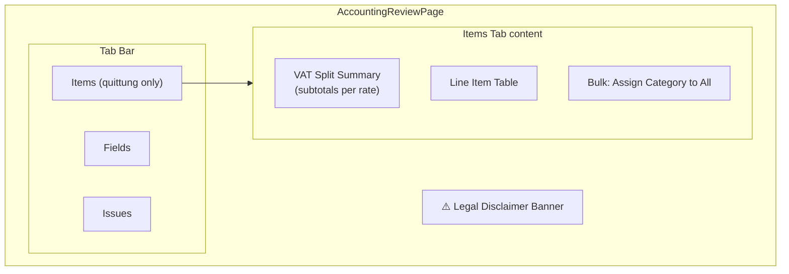

The "Items" tab is only rendered when `record.belegart === 'quittung'`.

#### Line Item Table

| Column | Content |
|--------|---------|
| # | Position on receipt |
| Description | Product name |
| Qty | Quantity + unit |
| Unit Price | Formatted EUR |
| Total | Formatted EUR (red if negative) |
| VAT | Badge: `7%` / `19%` / `0%` |
| Category | Dropdown — AI pre-filled, user editable |
| Confidence | AI confidence indicator (shown only if < 0.7) |

#### VAT Split Summary Card

Above the item table, a summary card shows subtotals broken down by VAT rate:

```
┌─────────────────────────────────────────────┐
│  VAT Breakdown                              │
│  19%  Net: €12.50   VAT: €2.38  Gross: €14.88 │
│   7%  Net: €8.41    VAT: €0.59  Gross: €9.00  │
│   0%  Net: €2.00    VAT: €0.00  Gross: €2.00  │
│  ─────────────────────────────────────────── │
│  Total:             VAT: €2.97  Gross: €25.88 │
└─────────────────────────────────────────────┘
```

#### New Components

| Component | Description |
|-----------|-------------|
| `ReceiptItemsTab` | Container: VAT split card + item table + bulk action bar |
| `ReceiptItemRow` | Single table row; inline category dropdown; shows confidence warning if low |
| `VatSplitCard` | Subtotals per VAT rate + grand total row |
| `ItemCategorySelect` | Dropdown populated from `/api/item-categories`; supports "Other" as fallback |
| `BulkCategoryAssign` | Button + dropdown: "Assign all uncategorized items to…" |

### 15.9 New File Structure

```
server/src/
├── services/
│   └── receipt-item-service.ts     # Item extraction orchestration + DB writes
├── routes/
│   └── receipt-items.ts            # /api/documents/:id/receipt-items, /api/receipt-items/:id, /api/item-categories
└── db/
    └── migrations/
        └── 013-receipt-items.sql   # item_categories (seeded) + receipt_items tables

client/src/
├── pages/
│   └── accounting-review-page.tsx  # Extended — new "Items" tab
└── components/
    ├── receipt-items-tab.tsx        # New — full items tab layout
    ├── receipt-item-row.tsx         # New — single table row with inline category select
    ├── vat-split-card.tsx           # New — VAT rate breakdown summary
    ├── item-category-select.tsx     # New — category dropdown
    └── bulk-category-assign.tsx     # New — bulk category assignment
```

### 15.10 Type Model Extensions

#### Server (`server/src/types/models.ts`)

```typescript
export interface ItemCategory {
  id: number;
  name: string;
  description: string | null;
  skr03_konto: string | null;
  skr03_konto_name: string | null;
  parent_id: number | null;
  is_system_category: number;
}

export interface ReceiptItem {
  id: number;
  document_id: number;
  position: number;
  description: string;
  quantity: number;
  unit: string | null;
  unit_price: number | null;
  total_price: number;
  vat_rate: number;
  vat_amount: number | null;
  ai_suggested_category_id: number | null;
  confirmed_category_id: number | null;
  confidence: number | null;
  created_at: string;
  // joined fields
  ai_suggested_category?: ItemCategory;
  confirmed_category?: ItemCategory;
}
```

#### Client (`client/src/types/models.ts`)

Same interfaces mirrored on the client side.

### 15.11 Risks & Mitigations

| # | Risk | Severity | Likelihood | Mitigation |
|---|------|----------|------------|------------|
| RI-R1 | LLM misreads prices (German comma vs dot) | High | Medium | Parse with `parseFloat(str.replace(',', '.'))` — reject items where `unit_price × quantity ≠ total_price` (> 0.02 EUR) |
| RI-R2 | Loyalty discounts / Pfand confuse item count | Medium | High | Negative-price items are accepted; flagged in UI with "Return / Discount" label |
| RI-R3 | Mixed private/business items on one receipt | Medium | High | "Private (non-deductible)" category available; UI warning if any item is categorized as private |
| RI-R4 | LLM hallucinates items not on receipt | Low | Low | Cross-validate: `Σ total_price ≈ brutto_betrag ± 0.05 EUR`; flag mismatch as `accounting_field_issue` |
| RI-R5 | Category taxonomy too narrow | Low | Medium | "Other / Uncategorized" fallback; user can add custom categories via `/api/item-categories` |
| RI-R6 | Receipt is thermal paper — low OCR/vision quality | Medium | Medium | Vision LLM has inherent image understanding; Sharp normalization (contrast, sharpness) applied before vision call |
| RI-R7 | Multi-page receipts (long supermarket slip) | Low | Low | pdf2pic renders first page; image scrolls to show full slip for image files |

### 15.12 Implementation Phases

| Phase | Task | Priority |
|-------|------|----------|
| RI-1 | DB migration `013-receipt-items.sql` — `item_categories` (seeded) + `receipt_items` | P0 |
| RI-2 | Vision prompt for item extraction in `prompt-templates.ts` | P0 |
| RI-3 | Vision prompt for batch category suggestion in `prompt-templates.ts` | P0 |
| RI-4 | `receipt-item-service.ts` — extract items, classify, validate sum, write to DB | P0 |
| RI-5 | Trigger in `processing-pipeline.ts` when `belegart = quittung` | P0 |
| RI-6 | REST endpoints in `receipt-items.ts` + register in `app.ts` | P1 |
| RI-7 | `ReceiptItemsTab` component + integration in `AccountingReviewPage` | P1 |
| RI-8 | `ReceiptItemRow` with inline `ItemCategorySelect` + `BulkCategoryAssign` | P1 |
| RI-9 | `VatSplitCard` component | P1 |
| RI-10 | Type model extensions (server + client `models.ts`) | P0 |
| RI-11 | API client methods in `client/src/lib/api.ts` | P1 |

---
